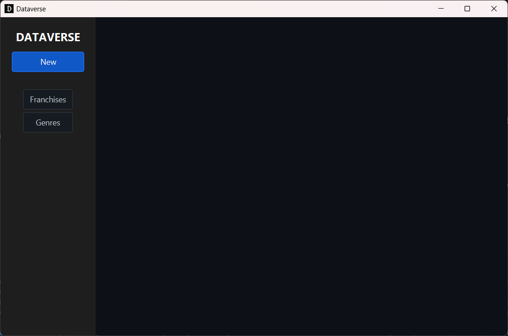
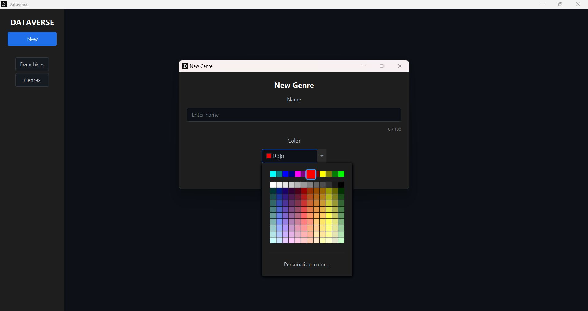
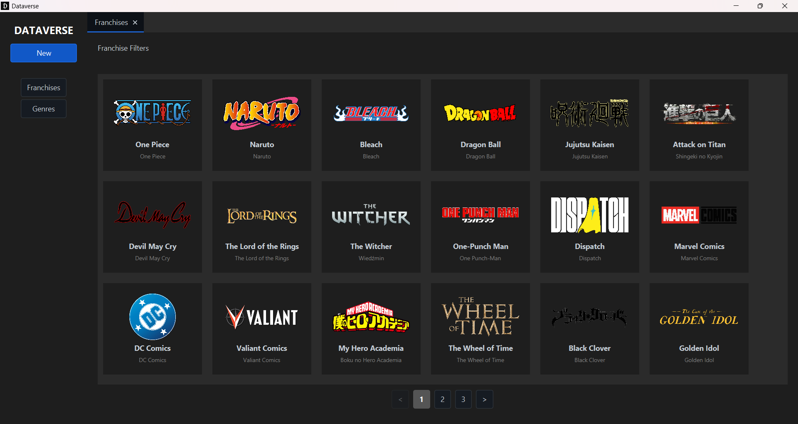
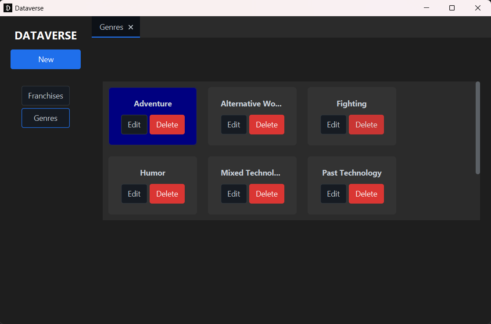

<pre>
________          __                                              _____                 
\______ \ _____ _/  |______ ___  __ ___________  ______ ____     /  _  \ ______ ______  
|    |  \\__  \\   __\__  \\  \/ // __ \_  __ \/  ___// __ \   /  /_\  \\____ \\____ \
|    `   \/ __ \|  |  / __ \\   /\  ___/|  | \/\___ \\  ___/  /    |    \  |_> >  |_> >
/_______  (____  /__| (____  /\_/  \___  >__|  /____  >\___  > \____|__  /   __/|   __/
\/     \/          \/          \/           \/     \/          \/|__|   |__|
</pre>

# Dataverse App Showcase

A clean and modern JavaFX application showcasing a fully functional CRUD workflow with pagination, asynchronous data loading, image management, and a scalable architectural foundation suitable for real desktop applications.

This project serves both as a professional portfolio piece and as a reference implementation of high-quality JavaFX UI/UX, code organization, and maintainable desktop client architecture.

---

## Features

### Modern JavaFX Interface

* Responsive layout using `BorderPane`, `TilePane`, and structured view composition.
* Clear separation between filters, lists, and detail views.
* Dark UI theme via **AtlantaFX PrimerDark** (fallback to default JavaFX is supported).

### CRUD Operations

Fully implemented Create / Read / Update / Delete workflows for:

* **Franchises**
* **Genres** (includes a color picker)

### Image Handling

* Load, preview, replace, and delete images safely.
* Scaled rendering for search cards and detail views.
* Automatic cleanup of temporary files when an operation fails.

### Asynchronous Execution

* Background threads for I/O and database operations using a custom `FxExecutor`.
* UI never freezes during pagination, form submission, or image processing.
* Loading overlays prevent interaction during long-running tasks.

### Pagination

* Real page-based backend querying (not client-side slicing).
* Smooth navigation even with large datasets.
* Dynamic numbered pagination with Previous / Next controls.

### Scalable Architecture

Designed for easy expansion and maintainability:

* Clean controller separation
* Search handler strategy (`SearchHandler` per entity type)
* Reusable utilities (`ImageHelper`, `TabManager`, `AlertHelper`, etc.)
* Consistent Entity → Form → Details workflow
* Spring Boot context embedded only for DI and service structure (UI remains framework-agnostic)

---

## Additional Utilities Implemented (Partially Used or Prepared for Future Features)

The codebase includes several utilities that demonstrate architectural foresight, even if not fully integrated yet:

### Debouncer

A lightweight utility ready for implementing debounced search filters or delayed UI reactions.

### Search Filters Framework

`SearchHandler.getSearchFilters()` is prepared for future filter UIs.
Current implementation uses placeholders but the plumbing for full filter support already exists.

### CloseRequestHelper

Provides unsaved-changes detection and graceful window-closing confirmation.
Only partially used now, but fully operational.

### ImageSelector Enhancements (Planned)

Designed with extensibility in mind:

* Future GIF support
* Video file handling
* Clipboard-based image insertion (already implemented)

These unfinished areas demonstrate intentional modularity and potential for future growth.

---

## Technologies Used

* **Java 21**
* **JavaFX 21**
* **Maven**
* **Spring Boot** (embedded for DI only)
* **AtlantaFX** for styling
* **Hibernate / Spring Data JPA** for persistence

---

## Project Structure (Simplified)

```
src/main/java
 ├─ com.alejandroacg.dataverseappshowcase
 │   ├─ controllers/
 │   ├─ models/
 │   ├─ services/
 │   ├─ search/
 │   ├─ tasks/
 │   ├─ utils/
 │   └─ AppLauncher.java
src/main/resources
 ├─ views/
 ├─ static/css/
 ├─ static/img/
 └─ application.properties
```

---

## Screenshots
### Main Screen


### Franchise Form


### Genre Form


### Search Franchise


### Search Genre


---

## How to Run

```
mvn clean javafx:run
```

Requirements:

* JDK 21+
* Maven 3.8+
* Internet access for dependency resolution

---

## Purpose of This Repository

This project is intentionally small, focused, and production-quality.
It demonstrates capability in:

* Modern JavaFX development
* UI/UX design for desktop applications
* Asynchronous task management
* Safe file handling and image processing
* Scalable CRUD architectures backed by Spring Data JPA

It is suitable both as a portfolio sample and as a template for larger JavaFX applications.

---

## License

This software and its source code are the exclusive property of the author.

Unless you have explicit written permission from the author, you MAY NOT:

- Use the software or source code.
- Copy or reproduce it.
- Modify or create derivative works.
- Distribute or publish it.
- Sublicense or sell it.
- Include it in other projects.

All rights reserved © 2025.

---

## Optional Enhancements

Potential future additions:

* Real search filters with debouncing
* Virtualized lists for extremely large datasets
* Additional entities and relational views
* REST API data source instead of local repository
* Theming customization and user preferences storage